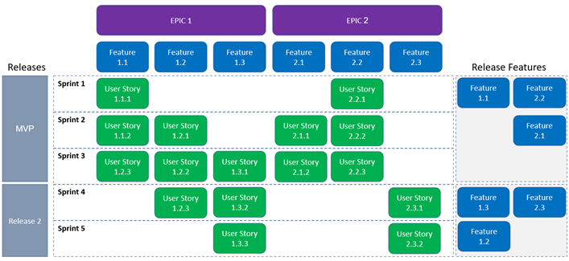

**UNIVERSIDADE LUSÓFONA DE HUMANIDADES E TECNOLOGIAS**

# Software Engineering - Laboratory 1: 🥼 <br>*Agile Software Development - A User Story Slicing Exercise*

**OBJECTIVE**: In this exercise, you will learn to:
* Create optimal flows in a Scrum Board/Kanban board; 
* The standard story format and write a good user story;
* Understanding User Stories sizes using Story Points;
* User story estimation using Poker Planning with Fibonnaci voting system.

**PRE-REQUISITES**:
* Teorical lecture and practical classes slide deck;
* Ensemble a group of 1-4 people and give a funny name to your team;
* Create an account in [Trello](https://forms.gle/yTsVwecqnvaTNtWKA) you can use an existing account, university or personal email address;
* For the Poker Planning go to [link](https://planningpokeronline.com);
    * Th


# Let's start with some theory 🤓

**What is a User Story?** 

One of the most important aspects of moving to Agile is understanding “stories”. It takes practice to write good stories, and this exercise allows you this practice. As the Product Owner, you must deliver your customer’s or stakeholder’s perspective and share with the project team what is needed and why.

User Story is a tool in which requirements are captured in an easy to understand plain language, and is written from the perspective of an end user. 

A user story must provide value to some user. An Agile process is driven by the completion of stories, each of which provides tangible, demonstrable value to the user/customer/stakeholder. A sprint consists of a set of conscientiously prioritized stories. Experience will show that it’s best to use a format for each story that identifies who the user is, what they need, and for what purpose (the why). Such stories are written in this format:

```
“As a ____, I need a ____ in order to ____”.
```

or 

```
As a < user > 
I want to < perform an action > 
So that < I expect…. > 
```

* The **who / user** in a user story could be someone with a particular functional role, who holds a certain title in the application software, comes from the perspective of a persona, or embodies the needs and behaviors of a hypothetical user. – “As a net banking customer”;

* The **what / perform an action** in a user story details in specific terms the need, feature, or functionality desired by the who. This is what your project team will build into the product or service. – “I want to add beneficiary in my account”;

* The **why / I expect** in a user story states the outcome and desired value. The user expects out of the action performed – “so that I can transfer money to the added beneficiary”.

Here’s an example of a user story that clearly defines the who, what, and why:
* *“As a jazz fan, I need a tuning knob in order to find a jazz station on the radio that I will enjoy listening to.”*.

User stories, based on the estimated size, are taken for implementation in an iteration. User stories should be granular enough that they can be completed within an iteration and cannot be continued in the following iteration. If a story cannot be completed within an iteration, the same should be split logically. User stories are prioritized by the product owner based on business priority and are available at the top of the product backlog. The dev team pulls the stories into an iteration backlog and implements them. The [Definition of Done(DOD)](https://www.scrum.org/resources/blog/done-understanding-definition-done?gclid=CjwKCAjwm8WZBhBUEiwA178UnFiFqICker4elVMX5oMU_LN-3V9opm5QzyoaX2zMIiFIRYlhl0MOwxoCZ5UQAvD_BwE) for user stories is decided by the team which includes acceptance criteria, and processes that need to be followed like unit testing, regression testing, code review, etc. The story is said to be “done” only when it meets the preset Definition of Done. 

**Keys to a Valuable User Story**
* Product Owners must have courage to ask for what they believe their users/customers/stakeholders really want.
* A story must have value to someone. It must make the product better in some way.
    * The story when complete will make a real-world task faster, better, easier to understand, have fewer steps, or collect better info;
    * The high priority stories affect the most users or procure the highest value dat;
    * Avoid exotic/one-off stories (i.e. edge cases).
* “Clean up the bugs we introduced in the last sprint” is NOT a user story because it does not add anything to the product.
* Remember the INVEST model! Good user stories are:
    * **I**ndependent - User stories should be independent of other stories. There should be no overlap between them. They can however follow one after the other in a sequence, in a way that makes it easy to schedule and implement them;
    * **N**egotiable - The story should not be written in so much detail that it becomes a requirement document. If it is in too much detail, it does not give an opportunity for the dev team to have any conversation with the product owner or the business. The story should be written with just enough detail so that it paves the way to open discussions with the product owner or business, and helps to elicit details or come up with creative solutions. By negotiating on the story with the relevant stakeholders, teams can come to a common understanding;
    * **V**aluable - The story should be valuable to the customer. It should clearly state why we are doing this? How is it going to produce value to the customer? What value will the customer realize by implementing this story?
    * **E**stimable - The user stories should have sufficient detail for the dev team to understand and estimate them. The conversation in 3 C’s helps the team to uncover the details with the product owner and stakeholders, so that they can size the story. If the story is too big and not sizeable, then the story should be refined or decomposed further. Whatever information the team may require should be available in the story for them to estimate it. In case there is a part of the story where the team has to do research, then a “spike” story may be created while the rest of the story can be estimated and taken for implementation;
    * **S**mall and - Good user stories should be small. This does not refer to the size or number of words written in a story. A small story is of the right length so that the implementation team can complete the story within an iteration. It should be small enough that the story is “fully delivered” during an iteration;
    * **T**estable - Testable – A good user story should be testable in order to be “Done”. This is supported by the “Confirmation” in 3 C’s where the team comes up with acceptance criteria for every story after the detailed conversation with the stakeholders. 
        * The customer should be clear about what he should test during the review. If he is not clear, then the story is not good enough to be implemented.
        * The team works together in a collaborative way to INVEST in good stories. The team learns to write good user stories as they work together and also proactively think about the values and criteria that are laid out in INVEST. 

**Types of User Stories**

We can classify user stories into functional and technical types: 

* **Functional** – Normally, a user story is written based on the functional aspects of the application software, while focusing on the user and the value of the functionality provided to the user. Functional stories concentrate on the product features which the customer will be testing at the end of an iteration based on the acceptance criteria defined for the story. 

* **Technical** – Technical stories are written to be able to support the functional stories. Technical stories can be classified as:
    * **Infrastructure stories** – any infrastructure addition/modification that may be required to support the functional story;
    * **Refactoring** – this type of story is written to maintain the code and address technical debts. This can be used for designing and automation needs as wel;
    * **Spikes** – stories that require research on architecture and design which may in turn help achieve the functional need of the custome.

**Example of User Stories**

Let us see some examples of user stories (Epics, Features and User Story) in this section. 

| ID | Epics |
|---|---|
| E1 | As a Sales Professional, I want to generate reports so that I can take a decision on the marketing strategy for the upcoming quarter |
| E2 | As a Banking Customer, I want to access net banking, so that I can access my account and make transactions |
| E3 | As an Administrator of the software, I want to access master records so that I can make changes to customer data |

| ID | Features |
|---|---|
| E2F1  | As a Banking Customer, I want to access Savings account so that I can view/make transactions |
| E2F2  | As a Banking Customer, I want to access Credit Card page, so that I can view and make transactions |
| E2F3  | As a Banking Customer, I want to access Loans page so that I can view my loans |
| E2F4  | As a Banking Customer, I want to transfer funds, so that I can move my funds to different accounts within my bank and other banks |

| ID | User Stories |
|---|---|
| E2F1U1 | As a Banking Customer, I want to access/view summary of my savings account, so that I know my balance and other details |
| E2F1U2 | As a Banking Customer, I want to Login to Net banking so that I can view credit card details |
| E2F4U1 | As a Banking Customer, I want to transfer funds within my own accounts so that I can move some balance across my accounts |
| E2F4U2 | As a Banking Customer, I want to transfer funds from my account to another account in another bank, so that  I can send money to my family and friends who have accounts in other banks |
| E2F4U3 | As a Banking Customer, I want to add beneficiary to my account, so that I can transfer funds to the beneficiary |

| ID | Technical User Stories |
|---|---|
| E2TU1 | As a Net Banking Administrator, I want to have the customer’s data backed up so that I can restore it any time in case of issues |
| E2TU2 | As a Net Banking application, I want to shake hands with another bank using a specific formatted XML so that funds can be transferred based on the customers’ needs |


**Example of an Agile Planning Roadmap**




**Summary in video format**
In the following [link](https://www.youtube.com/watch?v=LEPLaYcdgeg) you can find video that summarizes all of the above concepts.

# Activity 🤿


