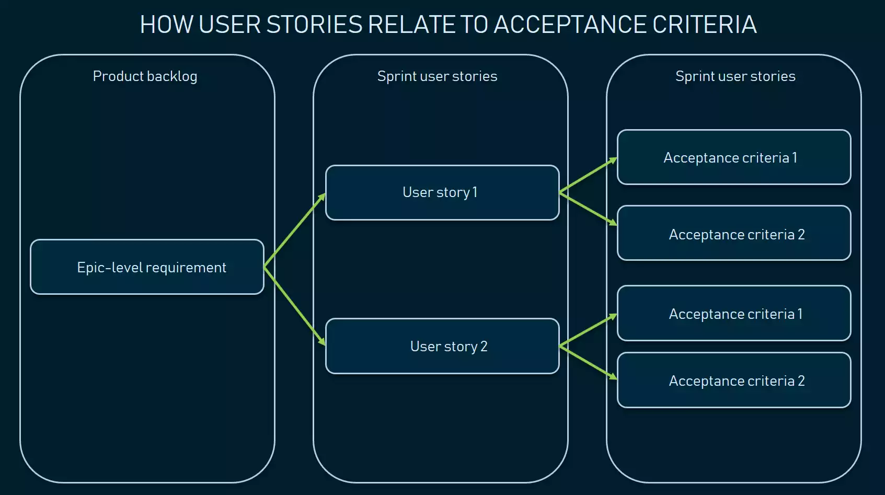
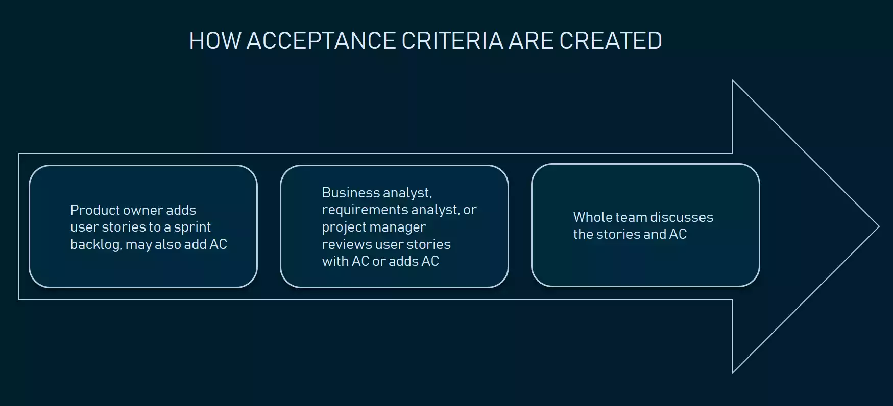
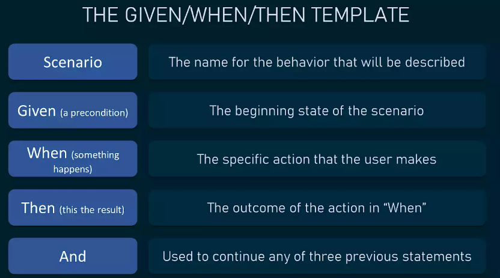
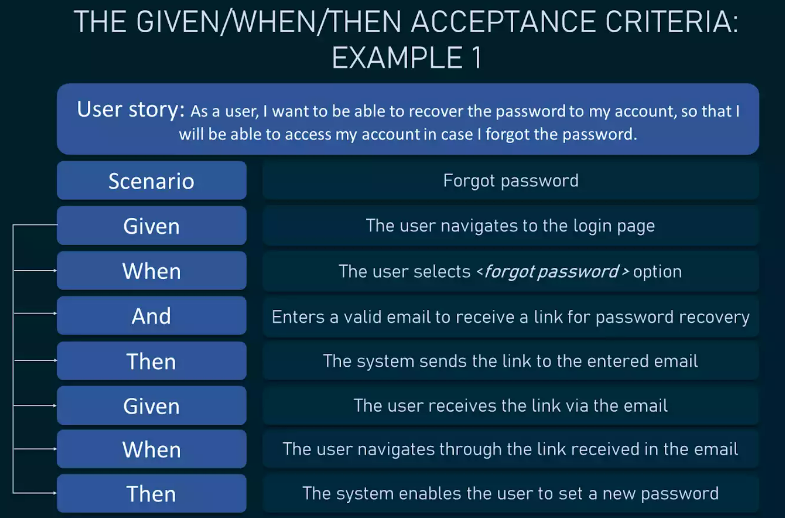
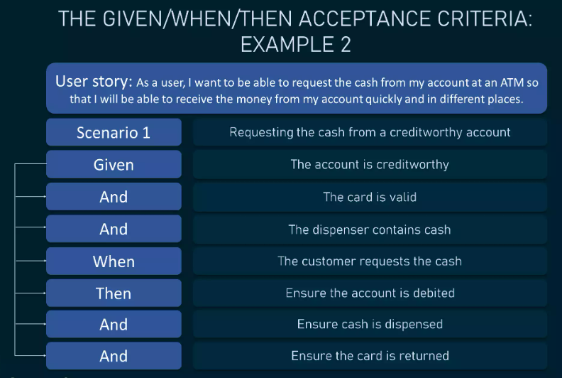
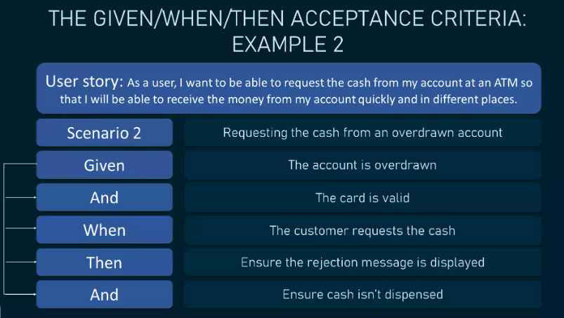
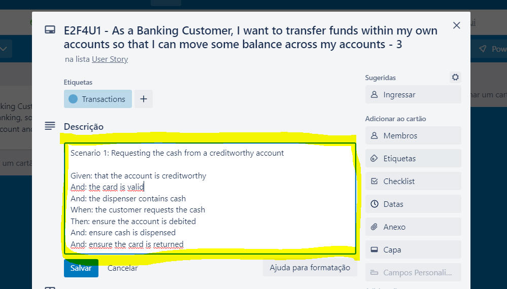

**UNIVERSIDADE LUSÓFONA DE HUMANIDADES E TECNOLOGIAS**

# Software Engineering - Laboratory 2: 🥼  *Agile Software Development - Writing Acceptance Criteria for User Stories*

**OBJECTIVE**: In this exercise, you will learn to:
* Understanding the main purpose of writting Acceptance Criteria(AC) on User Stories; 
* Acceptance criteria types and structures;
* Roles responsible and how acceptance criteria are created;
* GWT format to write Acceptance Criteria.

# Let's start with some theory 🤓

**What is a Acceptance Criteria (AC)?** 

**Acceptance criteria (AC)** are the conditions that a software product must meet to be accepted by a user, a customer, or other systems. They are unique for each user story and define the feature behavior from the end-user’s perspective.

Well-written acceptance criteria help avoid unexpected results in the end of a development stage and ensure that all stakeholders and users are satisfied with what they get.

An important aspect in regard to acceptance criteria is that they have to be defined before the development team starts working on a particular user story. Otherwise, there’s a decent chance the deliverables won’t meet the needs and expectations of a client.

**Roles responsible and how acceptance criteria are created?**
Some of the criteria are defined and written by the *product owner* when he or she creates the product backlog. And the others can be further specified by the team during user stories discussions after sprint planning.

**Acceptance criteria main purposes** 

Clarifying the stakeholder’s requirements is a high-level goal. To make the purposes of AC clearer, let’s break them down.

**Making the feature scope more detailed -** AC define the boundaries of user stories. They provide precise details on functionality that help the team understand whether the story is completed and works as expected.

**Describing negative scenarios -** Your AC may require the system to recognize unsafe password inputs and prevent a user from proceeding further. Invalid password format is an example of a so-called negative scenario when a user does invalid inputs or behaves unexpectedly. AC define these scenarios and explain how the system must react to them.

**Setting communication -** Acceptance criteria synchronize the visions of the client and the development team. They ensure that everyone has a common understanding of the requirements: Developers know exactly what kind of behavior the feature must demonstrate, while stakeholders and the client understand what’s expected from the feature.

**Streamlining acceptance testing -** AC are the basis of the user story acceptance testing. Each acceptance criterion must be independently testable and thus have clear pass or fail scenarios. They can also be used to verify the story via automated tests.

**Conducting feature evaluations -** Acceptance criteria specify what exactly must be developed by the team. Once the team has precise requirements, they can split user stories into tasks that can be correctly estimated.

Since different people can have different points of view and solution ideas regarding one problem, creating a unified vision of how the functionality should be implemented is necessary. That’s exactly what clearly written acceptance criteria do.

**Acceptance criteria types and structures**

Based on the initial task and the complexity of requirements, acceptance criteria can be written in different formats, namely:

* scenario-oriented (the Given/When/Then template);
* rule-oriented (the checklist template); and
* custom formats.

Most commonly used, the first and the second formats have very specific structures, so we’ll mainly focus on them. However, you may find that other formats fit your product better so we’ll briefly touch on them as well.

**Scenario-oriented acceptance criteria**

As the name suggests, the scenario-oriented format is the acceptance criteria type that comes in the scenario form and illustrates each criterion. It is approached through the Given/When/Then (GWT) sequence that looks like this:

* Given some precondition
* When I do some action
* Then I expect some result

This approach was inherited from behavior-driven development (BDD) and provides a consistent structure that helps testers define when to begin and end testing a particular feature. It also reduces the time spent on writing test cases as the behavior of the system is described upfront.

The acceptance criteria template in this format includes the following statements:

1. **Scenario** – the name for the behavior that will be described
2. **Given** – the beginning state of the scenario
3. **When** – specific action that the user makes
4. **Then** – the outcome of the action in “When”
5. **And** – used to continue any of three previous statements

When combined, these statements cover all actions that a user takes to complete a task and experience the outcome.

Let’s look at some examples

**Example 1**

**User story:** *As a user, I want to be able to recover the password to my account, so that I will be able to access my account in case I forgot the password.*

**Scenario:** Forgot password

* **Given:** The user navigates to the login page
* **When:** The user selects <forgot password> option
* **And:** Enters a valid email to receive a link for password recovery
* **Then:** The system sends the link to the entered email
* **Given:** The user receives the link via the email
* **When:** The user navigates through the link received in the email
* **Then:** The system enables the user to set a new password

**Example 2**

**User story:** *As a user, I want to be able to request the cash from my account at an ATM so that I will be able to receive the money from my account quickly and in different places.*

**Scenario 1:** Requesting the cash from a creditworthy account

* **Given:** that the account is creditworthy
* **And:** the card is valid
* **And:** the dispenser contains cash
* **When:** the customer requests the cash
* **Then:** ensure the account is debited
* **And:** ensure cash is dispensed
* **And:** ensure the card is returned

**Scenario 2:** Requesting the cash from an overdrawn account

* **Given:** that the account is overdrawn
* **And:** the card is valid
* **When:** the customer requests the cash
* **Then:** ensure the rejection message is displayed
* **And:** ensure cash isn’t dispensed

# Exercise - Part 1/1 (Write Acceptance criteria (AC) for User Stories done in [Laboratory 1](https://github.com/logdarkmatter/ES-2022-2023/tree/main/lab1)) 🤿

**PRE-REQUISITES** 👓:
* Theoretical lecture and practical classes slide deck;
* Carefully read and comprehend the Acceptance Criteria (AC) concept as stated above;
* Have completed the [Laboratory 1](https://github.com/logdarkmatter/ES-2022-2023/tree/main/lab1);

**Let's start** 🏁:
1. With the same group you formed in Laboratory 1 exercise open your Trello board;
2. Brainstorm with your team:
    * on the most valuable top 10 user stories (To do U/S & the top on the product backlog (User Story column)) at least:
        * 1-N Acceptance criteria (AC) in GWT-scenario-oriented format.

**Notes**:
* Remember to keep them in the scenario-oriented format for functional user stories: "GWT”;
* More detailed your U/S is with Acceptance Criteria (AC) better the grade you will have;
* Add your Acceptance Criteria (AC) by opening the card on Trello and adding the AC to the card description. See the example below:

# Good Luck!! 🍀 
