**UNIVERSIDADE LUSÓFONA DE HUMANIDADES E TECNOLOGIAS**

# Software Engineering - Laboratory 4: 🥼  *Entity-Relationship Diagram Symbols and Notation*

**OBJECTIVE**: In this exercise, you will learn to:
* Why make an ERD; 
* ERD entity symbols;
* ERD relationship symbols (cardinality);
* ERD attribute symbols:
* ER diagram notation.

# Let's start with some theory 🤓

**What is an Entity Relationship Diagram (ERD)?** 

ERD stands for entity relationship diagram. People also call these types of diagrams ER diagrams and Entity Relationship Models. An ERD visualizes the relationships between entities like people, things, or concepts in a database. An ERD will also often visualize the attributes of these entities.

By defining the entities, their attributes, and showing the relationships between them, an ER diagram can illustrate the logical structure of databases. This is useful for engineers hoping to either document a database as it exists or sketch out a design of a new database.

**Why Make an ERD?**
An ER diagram can help businesses document existing databases and thereby troubleshoot logic or deployment problems or spot inefficiencies and help improve processes when a business wants to undertake business process re-engineering. ERDs can also be used to design and model new databases and make sure that engineers can identify any logic or design flaws before they're implemented in production:
* Document an existing database structure
* Debug, troubleshoot, and analyze
* Design a new database
* Gather design requirements
* Business process re-engineering (BPR)

When documenting a system or process, looking at the system in multiple ways increases the understanding of that system. ERD diagrams are commonly used in conjunction with a data flow diagram to display the contents of a data store. They help us to visualize how data is connected in a general way, and are particularly useful for constructing a relational database.

**ERD Models**
Entity Relationship Models can also vary based on the level of abstraction visualized. There are usually three models people refer to based on the level of detail you want to show: conceptual ERD, logical ERD, and physical ERD.

* **Conceptual ERD or data model:** This model has the most abstraction and least amount of detail, as such it's appropriate for large projects that need a higher level view used by business analysts. A typical conceptual ERD will contain entities and relationships, but offer no details on specific database columns or cardinalities. It's a general, high-level view of database design.
* **Logical ERD or data model:** This model adds more detail to the conceptual model by defining additional entities that are operational and transactional.
* **Physical ERD or data model:** This model serves as the actual design or blueprint of the database with lots of technical details including defining cardinality and showing primary and foreign keys of entities instead of just their abstract semantic names. For this type of ERD, attributes will often be listed to represent the columns of the real database table.

**Common ERD Symbols**

Entities are objects or concepts that represent important data. Entities are typically nouns such as product, customer, location, or promotion. There are three types of entities commonly used in entity relationship diagrams.

* **Entities**, These shapes are independent from other entities, and are often called parent entities, since they will often have weak entities that depend on them. They will also have a primary key, distinguishing each occurrence of the entity.
    * 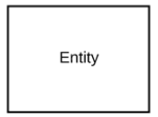 
* A **weak entity** Weak entities depend on some other entity type. They don't have primary keys, and have no meaning in the diagram without their parent entity..
    * 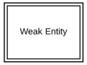 
* **Associative entity** Associative entities relate the instances of several entity types. They also contain attributes specific to the relationship between those entity instances.
    * 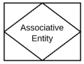 
	
**ERD relationship symbols**

Within entity-relationship diagrams, relationships are used to document the interaction between two entities. Relationships are usually verbs such as assign, associate, or track and provide useful information that could not be discerned with just the entity types.

* **Relationship**, Relationships are associations between or among entities.
    *  
* **Weak Relationships** Weak Relationships are connections between a weak entity and its owner.
    *  

**ERD attribute symbols**
ERD attributes are characteristics of the entity that help users to better understand the database. Attributes are included to include details of the various entities that are highlighted in a conceptual ER diagram.

* **Attribute**, Attributes are characteristics of an entity, a many-to-many relationship, or a one-to-one relationship.
    * 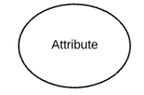 
* **Multivalued attribute** Multivalued attributes are those that are can take on more than one value.
    * 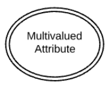 
* **Derived attribute** Derived attributes are attributes whose value can be calculated from related attribute values.
    * 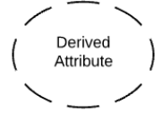 
* **Relationshipe** Relationships are associations between or among entities.
    * 

**Styles of Cardinality** 
**Cardinality** is the mathematical sense just means the number of values in a set. In relationship to databases and ERD, cardinality specifies how many instances of an entity relate to one instance of another entity. Ordinality is also closely linked to cardinality. While cardinality specifies the occurrences of a relationship, ordinality describes the relationship as either mandatory or optional. In other words, cardinality specifies the maximum number of relationships and ordinality specifies the absolute minimum number of relationships.

In other words, there will be multiple instances of each entity in a database. Cardinality allows you express the number of each entity that can be associated with another entity. For example, in an employee database, a manager will have multiple employee reports (in a one to many relationship), but an employee will only have one ID number (a one to one relationship). There are three main types of relationships in a database expressed using cardinality notation in an ER diagram.

* one-to-one
* one-to-many
* many-to-many

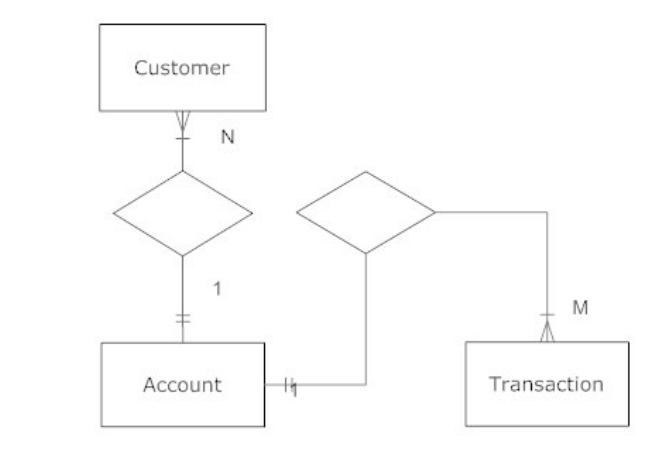

There are many notation styles that express cardinality.
**Information Engineering Style, IE Notation or Crow's Foot Notation**
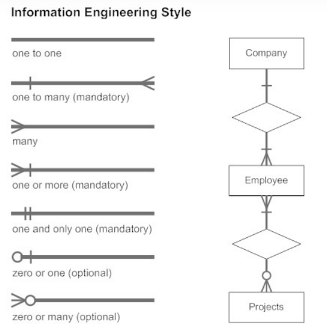

# ERD Examples
**Example 1** 
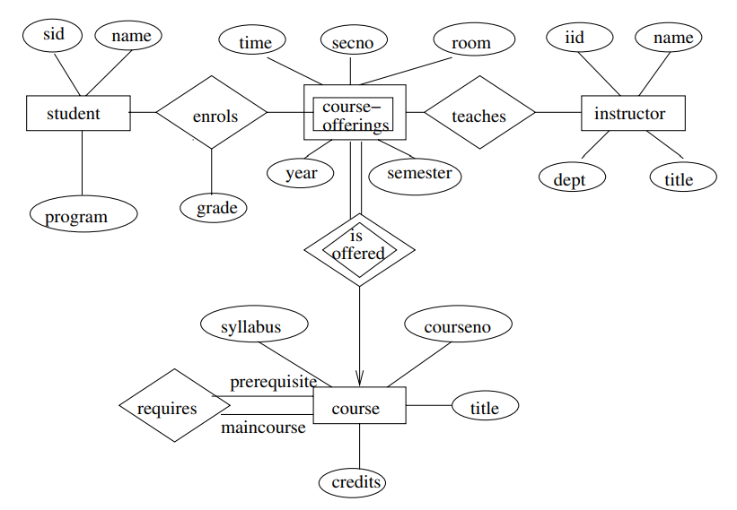
**Example 2** 
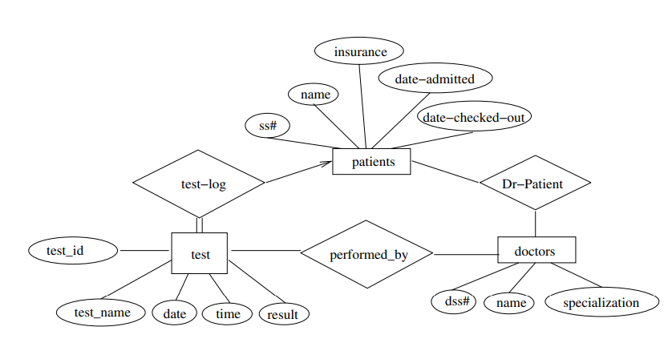
**Example 3** 
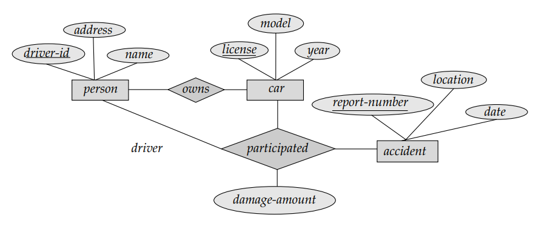

# Exercise - Part 1/1 Conceptual ERD 🤿

**PRE-REQUISITES** 👓:
* Theoretical lecture and practical classes slide deck;
* Carefully read and comprehend the Relationship Diagram Symbols and Notation concept as stated above;
* Have completed the [Laboratory 1](https://github.com/logdarkmatter/ES-2022-2023/tree/main/lab1);
* Have completed the [Laboratory 2](https://github.com/logdarkmatter/ES-2022-2023/tree/main/lab2);
* Have completed the [Laboratory 3](https://github.com/logdarkmatter/ES-2022-2023/tree/main/lab3);

**Let's start** 🏁:
1. With the same group you formed in the previous labs... 
2. Create a new column in your Trello board named "UML" and a new Trello card inside the new column named "Conceptual ERD";
3. Look in to our user stories, acceptance criteria and future of the solution (big picture) and using the tool [Diagrams.net aka Draw.io](https://app.diagrams.net/) please elaborate the Conceptual ERD for your solution:
    * **Identify the entities:** The first step in making an ERD is to identify **ALL** the entities you will use. An entity is nothing more than a rectangle with a description of something that your system stores information about. This could be a customer, a manager, an invoice, a schedule, etc. Draw a rectangle for each entity you can think of on your page. Keep them spaced out a bit;
    * **Identify relationships:** Look at your entities, are they related? If so draw a solid line connecting the two entities and add a diamond between them with a brief description of how they are related;
    * **Add attributes:** Any key attributes of entities should be added using oval-shaped symbols;
    * **Complete the diagram:** Continue to connect the entities with lines, and adding diamonds to describe each relationship until all relationships have been described. Each of your entities may not have any relationships, some may have multiple relationships.
4. After concluding your Conceptual ERD, export it as a PNG and import the image into our new card "Conceptual ERD";

**Tips for Effective ER Diagrams**
* Make sure that each entity only appears once per diagram.
* Name every entity, relationship, and attribute on your diagram.
* Examine relationships between entities closely. Are they necessary? Are there any relationships missing? Eliminate any redundant relationships. Don't connect relationships to each other.
* Use colors to highlight important portions of your diagram.

# Good Luck!! 🍀 
