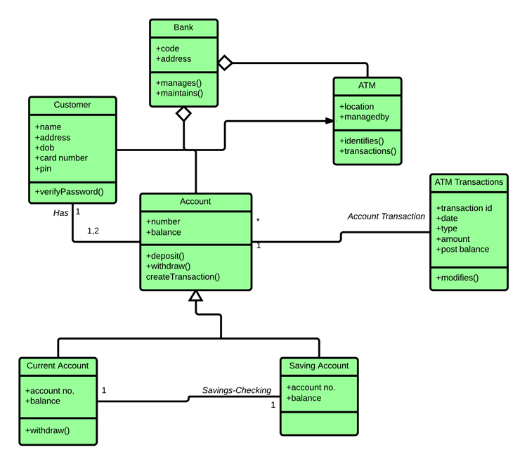

**UNIVERSIDADE LUSÓFONA DE HUMANIDADES E TECNOLOGIAS**

# Software Engineering - Laboratory 5: 🥼  *UML - Class Diagram*

**OBJECTIVE**: In this exercise, you will learn to:
* Importance of a class diagram; 
* Class diagram symbols;
* Class diagram relationship symbols (cardinality);
* Class diagram attribute symbols:
* Class diagram notation;
* Domain-Driven Design.

# Let's start with some theory 🤓

Class diagrams are one of the most useful types of diagrams in UML as they clearly map out the structure of a particular system by modeling its classes, attributes, operations, and relationships between objects.

**What is a class diagram in UML?** 

The Unified Modeling Language (UML) can help you model systems in various ways. One of the more popular types in UML is the class diagram. Popular among software engineers to document software architecture, class diagrams are a type of structure diagram because they describe what must be present in the system being modeled. No matter your level of familiarity with UML or class diagrams, our UML software is designed to be simple and easy to use.

UML was set up as a standardized model to describe an object-oriented programming approach. Since classes are the building block of objects, class diagrams are the building blocks of UML. The various components in a class diagram can represent the classes that will actually be programmed, the main objects, or the interactions between classes and objects. 

The class shape itself consists of a rectangle with three rows. The top row contains the name of the class, the middle row contains the attributes of the class, and the bottom section expresses the methods or operations that the class may use. Classes and subclasses are grouped together to show the static relationship between each object.

The UML shape library in Lucidchart can help you create nearly any custom class diagram using our UML diagram tool.

**Benefits of class diagrams**
Class diagrams offer a number of benefits for any organization. Use UML class diagrams to:

* Illustrate data models for information systems, no matter how simple or complex.
* Better understand the general overview of the schematics of an application.
* Visually express any specific needs of a system and disseminate that information throughout the business.
* Create detailed charts that highlight any specific code needed to be programmed and implemented to the described structure.
* Provide an implementation-independent description of types used in a system that are later passed between its components..

**Basic components of a class diagram**
The standard class diagram is composed of three sections:

* **Upper section:** Contains the name of the class. This section is always required, whether you are talking about the classifier or an object.
* **Middle section:** Contains the attributes of the class. Use this section to describe the qualities of the class. This is only required when describing a specific instance of a class.
* **Bottom section:** Includes class operations (methods). Displayed in list format, each operation takes up its own line. The operations describe how a class interacts with data.

**Member access modifiers**
All classes have different access levels depending on the access modifier (visibility). Here are the access levels with their corresponding symbols:

* **Public (+)**
* **Private (-)**
* **Protected (#)**
* **Package (~)**
* **Derived (/)**
* **Static (underlined)**

**Member scope**
There are two scopes for members: classifiers and instances.

Classifiers are static members while instances are the specific instances of the class. If you are familiar with basic OO theory, this isn't anything groundbreaking.

**Additional class diagram components**
Depending on the context, classes in a class diagram can represent the main objects, interactions in the application, or classes to be programmed. To answer the question "What is a class diagram in UML?" you should first understand its basic makeup.

* **Classes:** A template for creating objects and implementing behavior in a system. In UML, a class represents an object or a set of objects that share a common structure and behavior. They're represented by a rectangle that includes rows of the class name, its attributes, and its operations. When you draw a class in a class diagram, you're only required to fill out the top row—the others are optional if you'd like to provide more detail.

    * **Name:** The first row in a class shape.

    * **Attributes:** The second row in a class shape. Each attribute of the class is displayed on a separate line.

    * **Methods:** The third row in a class shape. Also known as operations, methods are displayed in list format with each operation on its own line.

* **Signals:** Symbols that represent one-way, asynchronous communications between active objects.

* **Data types:** Classifiers that define data values. Data types can model both primitive types and enumerations.

* **Packages:** Shapes designed to organize related classifiers in a diagram. They are symbolized with a large tabbed rectangle shape.

* **Interfaces:** A collection of operation signatures and/or attribute definitions that define a cohesive set of behaviors. Interfaces are similar to classes, except that a class can have an instance of its type, and an interface must have at least one class to implement it.

* **Enumerations:** Representations of user-defined data types. An enumeration includes groups of identifiers that represent values of the enumeration.

* **Objects:** Instances of a class or classes. Objects can be added to a class diagram to represent either concrete or prototypical instances.

* **Artifacts:** Model elements that represent the concrete entities in a software system, such as documents, databases, executable files, software components, etc.

**Interactions**
The term "interactions" refers to the various relationships and links that can exist in class and object diagrams. Some of the most common interactions include:

* **Inheritance:** The process of a child or sub-class taking on the functionality of a parent or superclass, also known as generalization. It's symbolized with a straight connected line with a closed arrowhead pointing towards the superclass.

 

In this example, the object "Car" would inherit all of the attributes (speed, numbers of passengers, fuel) and methods (go(), stop(), changeDirection()) of the parent class ("Vehicle") in addition to the specific attributes (model type, number of doors, auto maker) and methods of its own class (Radio(), windshieldWiper(), ac/heat()). Inheritance is shown in a class diagram by using a solid line with a closed, hollow arrow.

* **Bidirectional association:** The default relationship between two classes. Both classes are aware of each other and their relationship with the other. This association is represented by a straight line between two classes.

In the example above, the Car class and RoadTrip class are interrelated. At one end of the line, the Car takes on the association of "assignedCar" with the multiplicity value of 0..1, so when the instance of RoadTrip exists, it can either have one instance of Car associated with it or no Cars associated with it. In this case, a separate Caravan class with a multiplicity value of 0..* is needed to demonstrate that a RoadTrip could have multiple instances of Cars associated with it. Since one Car instance could have multiple "getRoadTrip" associations—in other words, one car could go on multiple road trips—the multiplicity value is set to 0..*

* **Unidirectional association:** A slightly less common relationship between two classes. One class is aware of the other and interacts with it. Unidirectional association is modeled with a straight connecting line that points an open arrowhead from the knowing class to the known class.

As an example, on your road trip through Arizona, you might run across a speed trap where a speed cam records your driving activity, but you won't know about it until you get a notification in the mail. It isn't drawn in the image, but in this case, the multiplicity value would be 0..* depending on how many times you drive by the speed cam.

# Class diagram examples

**Class diagram for a hotel management system**

**Class diagram for an ATM system**

# Exercise - Part 1/1 Create or class diagram ERD 🤿

**PRE-REQUISITES** 👓:
* Theoretical lecture and practical classes [slide deck](https://moodle.ensinolusofona.pt/mod/folder/view.php?id=116549);
* Carefully read and comprehend the Relationship Diagram Symbols and Notation concept as stated above;
* Have completed the [Laboratory 1](https://github.com/logdarkmatter/ES-2022-2023/tree/main/lab1);
* Have completed the [Laboratory 2](https://github.com/logdarkmatter/ES-2022-2023/tree/main/lab2);
* Have completed the [Laboratory 3](https://github.com/logdarkmatter/ES-2022-2023/tree/main/lab3);
* Have completed the [Laboratory 4](https://github.com/logdarkmatter/ES-2022-2023/tree/main/lab4);

**Let's start** 🏁:
1. With the same group you formed in the previous labs... 
2. In your Trello board in the column "UML" create a new Trello card column named "Class Diagram";
3. Look into your Conceptual Diagram done in [Laboratory 4](https://github.com/logdarkmatter/ES-2022-2023/tree/main/lab4) and map or Conceptual Diagram into a new Class Diagram. Please make sure that you add access modifiers, types and enumerators to your attributes; also make sure you have the 3 mandatory sections in the diagram (Upper, middle and Bottom);
    * Please make sure you use as much a Domain-Driven Design approach where you can personify your classes and add operation to it.  
4. After concluding your Conceptual ERD, export it as a PNG and import the image into our new card "Class Diagram";

# Good Luck!! 🍀 
