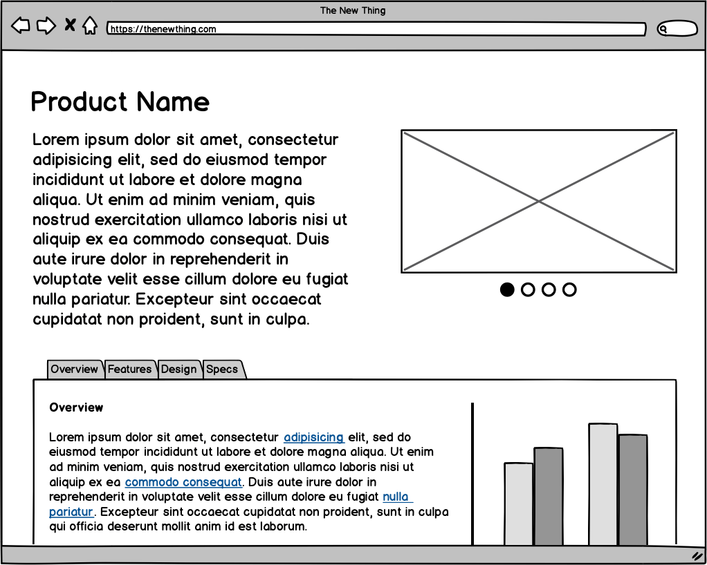

**UNIVERSIDADE LUSÓFONA DE HUMANIDADES E TECNOLOGIAS**

# Software Engineering - Laboratory 6: 🥼  *UI/UX - Wireframes*

**OBJECTIVE**: In this exercise, you will learn to:
* What is wireframe design;
* Why do Software companies use wireframes;
* What are different types of wireframe design;
* Benefits of design wireframes in projects.

# Let's start with some theory 🤓

# What is wireframe design?
A wireframe is a schematic or blueprint to design an application, software, or website at the structural level.

A wireframe is regularly used to design features and information on a website while taking user demands and user flows into account. It is used in the early development process to help clients, programmers, and designers think and communicate about the basic structure of the software or application before visual design and content are added.

# Why do Software companies use wireframes?
A software or website can be developed in different ways, with various features to match the client’s business model. Most of the time, our clients first come to us with tons of ideas for their tech products. However, In reality, only some of them will be genuinely effective, deliver the right message of the business, and lead to an easy-to-use software or website. As a result, creating a good interface structure may be the most essential phase in software design.

Making the wireframe before writing any code will save lots of project time and painful adjustment work later. In summary, there are 4 main reasons why software companies use wireframes before actually building your products.

* Wireframes help with delivering your message
* Wireframes help with defining the interface.
* Wireframes help with creating user-friendly applications and web pages.
* Wireframes help you avoid having to make adjustments later on

# What are different types of wireframe design?

There are many ways to categorize different types of wireframes. In this article, I divide it into three main types of wireframes which are low-fidelity wireframes, mid-fidelity wireframes, and high-fidelity wireframes, based on the amount of detail they contain

**Low-fidelity wireframes**
* The low fidelity wireframe is the most basic design of a website or software, which means it should be the starting point of a project design. As such, they are often quite primitive, not giving the viewer any sense of scale, grid, or pixel accuracy.

In terms of detail, Low Fidelity Wireframe omits any distracting details and includes only the most basic elements such as simple images, shapes, or simulated content.

Low Fidelity Wireframe is useful if you want to scribble something down with a pen in the middle of a meeting. They are also very helpful for clients who have several product concepts and need to determine quickly which direction to go.

**Mid-fidelity wireframes**
* This is the most common and widely used form of wireframe. Compared to low-fidelity wireframes, mid-fidelity wireframes are more detailed and accurately represent the layout. More information is allocated to particular components, and the application’s key features are identified while eliminating distracting elements like photos, typefaces, and font sizes.

Headings and body content might be separated using different font weights. Although remaining in black and white, the design team may express the significance of specific features by using various shades of grey. Mid-fidelity wireframes are often generated using a digital wireframing program, such as Sketch or Balsamiq, even though they are still helpful in the early phases of a project

**High-fidelity wireframes**
* The last type of wireframe is a high fidelity wireframe, these design is highly detailed. They will feature actual images as well as relevant textual material rather than simply black and white patches or frames with an “X” to indicate the area of pictures. These details make high-fidelity wireframes more concrete and closer to the final designs.

This type of wireframe is therefore well-suited to the later stages of the product design cycle, making it ideal for exploring and documenting complex concepts such as menu systems or interactive maps.

# 5 Benefits of Wireframing
1. **Key elements on a page.** The first and the most important reason to wireframe is the process of establishing a hierarchy of information on a page and nailing down the interface structure. Therefore, what is a wireframe for a website or application? It is a skeleton. Wireframes help define where the most important elements of a page are going to be to make the use of a digital product easier. 

2. **Communication in a team.** Wireframing helps the product team figure out whether the designers went in the right direction with a product. It allows them to find out the pain points that can or should be improved in the early stages. Wireframing ensures the team gets the message correctly and understands which way to build a screen before code is written and the final design is agreed upon. Doing this saves time on unnecessary improvements later.

3. **Clear product structure.** Wireframes make the structure of a future product clear for the whole team. They help to visualize the interface, highlighting the main features.

4. **Early feedback.** A wireframe gives an early view of a future product to clients. They give feedback on the core of the product before deciding on how to make it look. The wireframe is a solution for developers as well. They use it as a guide to get more into application/website functionality and generate quality code.

5. **Cost-effectiveness.** Among the main benefits of wireframing are speed and price. It can take under an hour to create the simplest sketch depending on how complex an application or website is. Compared to concept designs, wireframes are easier to fix. For a company, it will be cheaper to invest in wireframing to ensure the positions of the functionalities on the page are correct than to improve mistakes further in a project. Design should be applied in practice only after establishing a functional structure.

A wireframe is not the final version of the design. It serves as a starting point for a user interface. The team is open for discussion, incorporating new ideas, improvements, and feedback that are easy and quick to respond to.

# Why do wireframes look the way they do?
1. **Wireframes make it clear that this is not the final design** - No one could mistake a wireframe for the final look and feel of your application. Low-fidelity and few colors force you to focus on structure over details. There will be lots of time for visual design once the structure is finalized.

2. **Wireframes convey that "this is all up for discussion"** - The rough feel encourages discussion. We call it a look no one is afraid to criticize. Wireframes are really quick to make, so don't be shy with giving feedback! Each screen probably only took a few minutes to make; don't worry, their author won't mind doing them over from scratch. What matters the most at this point is the final ease of use, so going through a few iterations is normal and expected.

3. **Wireframes make it clear that no code has been written yet** - If your customer or stakeholder received some screens that looked like screenshots of the final app, instead of a wireframe, they might assume that all the code behind those screenshots had already been written. This is most often not the case. Wireframes don't have this danger.

# Wireframe examples

# Exercise - Part 1/1 Create wireframes for your 3 features 🤿

**PRE-REQUISITES** 👓:
* Theoretical lecture and practical classes [slide deck](https://moodle.ensinolusofona.pt/mod/folder/view.php?id=116549);
* Carefully read and comprehend the Relationship Diagram Symbols and Notation concept as stated above;
* Have completed the [Laboratory 1](https://github.com/logdarkmatter/ES-2022-2023/tree/main/lab1);
* Have completed the [Laboratory 2](https://github.com/logdarkmatter/ES-2022-2023/tree/main/lab2);
* Have completed the [Laboratory 3](https://github.com/logdarkmatter/ES-2022-2023/tree/main/lab3);
* Have completed the [Laboratory 4](https://github.com/logdarkmatter/ES-2022-2023/tree/main/lab4);
* Have completed the [Laboratory 5](https://github.com/logdarkmatter/ES-2022-2023/tree/main/lab5);

**Let's start** 🏁:
1. With the same group you formed in the previous labs... 
2. In your Trello board create a new column anmed "UI/UX";
2. In your Trello board in the new column "UI/UX" create a new Trello card column named "Wireframes";
3. Now you must design wireframes that represent the 3 features that you have created for your solution - Check you feature cards on the trello board;
    * The wireframes forms and attributes must match your logical and conceptual diagram attributes;
4. After concluding your wireframes, export them as a PNG and import the image into our new card "Wireframes".

**Tools**
* Some suggestions you can use:
    * [Diagrams.net aka Draw.io](https://app.diagrams.net/);
    * [https://balsamiq.com/](https://balsamiq.com/);
        * For the product key check the course main page [here](https://moodle.ensinolusofona.pt/course/view.php?id=7927#section-0);
    * [Figma](https://www.figma.com/);
    * [Miro](https://miro.com/pt/);
    * Powerpoint;
    * etc.

# Good Luck!! 🍀 
