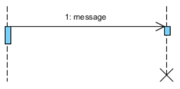

**UNIVERSIDADE LUSÓFONA DE HUMANIDADES E TECNOLOGIAS**

# Software Engineering - Laboratory 7: 🥼  *UML - Sequence Diagrams*

**OBJECTIVE**: In this exercise, you will learn to:
* What are sequence diagrams;
* Benefits of sequence diagrams;
* Use cases for sequence diagrams;
* Sequence diagrams dimensions;
* Sequence diagrams notation;
* Design sequence diagrams.

# Let's start with some theory 🤓

Sequence diagrams are a popular dynamic modeling solution in UML because they specifically focus on lifelines, or the processes and objects that live simultaneously, and the messages exchanged between them to perform a function before the lifeline ends. Along with our UML diagramming tool, use this guide to learn everything there is to know about sequence diagrams in UML.

# What is a sequence diagram in UML?
To understand what a sequence diagram is, it's important to know the role of the Unified Modeling Language, better known as UML. UML is a modeling toolkit that guides the creation and notation of many types of diagrams, including behavior diagrams, interaction diagrams, and structure diagrams.

A sequence diagram is a type of interaction diagram because it describes how—and in what order—a group of objects works together. These diagrams are used by software developers and business professionals to understand requirements for a new system or to document an existing process. Sequence diagrams are sometimes known as event diagrams or event scenarios.

Note that there are two types of sequence diagrams: UML diagrams and code-based diagrams. The latter is sourced from programming code and will not be covered in this guide. Lucidchart’s UML diagramming software is equipped with all the shapes and features you will need to model both.

# Benefits of sequence diagrams
Sequence diagrams can be useful references for businesses and other organizations. Try drawing a sequence diagram to:

* Represent the details of a UML use case;
* Model the logic of a sophisticated procedure, function, or operation;
* See how objects and components interact with each other to complete a process;
* Plan and understand the detailed functionality of an existing or future scenario.

# Sequence Diagram - Model before Code
Sequence diagrams can be somewhat close to the code level, so why not just code up that algorithm rather than drawing it as a sequence diagram?

* A good sequence diagram is still a bit above the level of the real code;
* Sequence diagrams are language neutral;
* Non-coders can do sequence diagrams;
* Easier to do sequence diagrams as a team;
* Can be used for testing and/or UX Wireframing.

# Use cases for sequence diagrams
The following scenarios are ideal for using a sequence diagram:

* **Usage scenario:** - A usage scenario is a diagram of how your system could potentially be used. It's a great way to make sure that you have worked through the logic of every usage scenario for the system;
* **Method logic:** - Just as you might use a UML sequence diagram to explore the logic of a use case, you can use it to explore the logic of any function, procedure, or complex process;
* **Service logic:** - If you consider a service to be a high-level method used by different clients, a sequence diagram is an ideal way to map that out.
* **Sequence diagram Visio** - Any sequence diagram that you create with Visio can also be uploaded into Lucidchart. Lucidchart supports .vsd and .vdx file import and is a great Microsoft Visio alternative. Almost all of the images you see in the UML section of this site were generated using Lucidchart.

# Object Dimension
* The horizontal axis shows the elements that are involved in the interaction;
* Conventionally, the objects involved in the operation are listed from left to right according to when they take part in the message sequence. However, the elements on the horizontal axis may appear in any order.

# Time Dimension
* The vertical axis represents time proceedings (or progressing) down the page.
    * **Note**: Time in a sequence diagram is all a about ordering, not duration. The vertical space in an interaction diagram is not relevant for the duration of the interaction.

# Sequence Diagram Notation

**Actor** 
* a type of role played by an entity that interacts with the subject (e.g., by exchanging signals and data)
* external to the subject (i.e., in the sense that an instance of an actor is not a part of the instance of its corresponding subject).
* represent roles played by human users, external hardware, or other subjects.
* **Note**: 
    * An actor does not necessarily represent a specific physical entity but merely a particular role of some entity;
    * A person may play the role of several different actors and, conversely, a given actor may be played by multiple different person.
* **Visual Representation**
    * 

**Lifeline**
* Represents the passage of time as it extends downward. This dashed vertical line shows the sequential events that occur to an object during the charted process. Lifelines may begin with a labeled rectangle shape or an actor symbol;
* A lifeline represents an individual participant in the Interaction.
* **Visual Representation**
    * 

**Activations**
* A thin rectangle on a lifeline) represents the period during which an element is performing an operation;
* The top and the bottom of the of the rectangle are aligned with the initiation and the completion time respectively;
* The longer the task will take, the longer the activation box becomes.
* **Visual Representation**
    * 

**Call Message**
* A message defines a particular communication between Lifelines of an Interaction;
* Call message is a kind of message that represents an invocation of operation of target lifeline.
* **Visual Representation**
    * 

**Return Message**
* A message defines a particular communication between Lifelines of an Interaction;
* Return message is a kind of message that represents the pass of information back to the caller of a corresponded former message.
* **Visual Representation**
    * 

**Self Message**
* A message defines a particular communication between Lifelines of an Interaction;
* Self message is a kind of message that represents the invocation of message of the same lifeline.
* **Visual Representation**
    * 

**Recrusive Message**
* A message defines a particular communication between Lifelines of an Interaction;
* Recursive message is a kind of message that represents the invocation of message of the same lifeline. It's target points to an activation on top of the activation where the message was invoked from.
* **Visual Representation**
    * 

**Create Message**
* A message defines a particular communication between Lifelines of an Interaction;
* Create message is a kind of message that represents the instantiation of (target) lifeline.
* **Visual Representation**
    * 

**Destroy Message**
* A message defines a particular communication between Lifelines of an Interaction;
* Destroy message is a kind of message that represents the request of destroying the lifecycle of target lifeline.
* **Visual Representation**
    * 

**Sequence Fragments**
* UML 2.0 introduces sequence (or interaction) fragments. Sequence fragments make it easier to create and maintain accurate sequence diagrams;
* A sequence fragment is represented as a box, called a combined fragment, which encloses a portion of the interactions within a sequence diagram;
* The fragment operator (in the top left cornet) indicates the type of fragment;
* Fragment types: ref, assert, loop, break, alt, opt, neg.

|  Operator  | Fragment Type |
|------------|---------------|
| **alt**    | Alternative multiple fragments: only the one whose condition is true will execute. |
| **opt**    | Optional: the fragment executes only if the supplied condition is true. Equivalent to an alt only with one trace. |
| **par**    | Parallel: each fragment is run in parallel. |
| **loop**   | Loop: the fragment may execute multiple times, and the guard indicates the basis of iteration. |
| **region** | Critical region: the fragment can have only one thread executing it at once. |
| **neg**    | Negative: the fragment shows an invalid interaction. |
| **ref**    | Reference: refers to an interaction defined on another diagram. The frame is drawn to cover the lifelines involved in the interaction. You can define parameters and a return value. |
| **sd**     | Sequence diagram: used to surround an entire sequence diagram. |

* **Note:**
    * It is possible to combine frames in order to capture, e.g., loops or branches; 
    * **Combined fragment keywords:** alt, opt, break, par, seq, strict, neg, critical, ignore, consider, assert and loop;
    * Constraints are usually used to show timing constraints on messages. They can apply to the timing of one message or intervals between messages.
        * Combinde fragments example:
            * 

# Method Logic - Sequence Diagram Examples:

# Exercise - Part 1/1 Create wireframes for your 3 features 🤿

**PRE-REQUISITES** 👓:
* Theoretical lecture and practical classes [slide deck](https://moodle.ensinolusofona.pt/mod/folder/view.php?id=116549);
* Carefully read and comprehend the Relationship Diagram Symbols and Notation concept as stated above;
* Have completed the [Laboratory 1](https://github.com/logdarkmatter/ES-2022-2023/tree/main/lab1);
* Have completed the [Laboratory 2](https://github.com/logdarkmatter/ES-2022-2023/tree/main/lab2);
* Have completed the [Laboratory 3](https://github.com/logdarkmatter/ES-2022-2023/tree/main/lab3);
* Have completed the [Laboratory 4](https://github.com/logdarkmatter/ES-2022-2023/tree/main/lab4);
* Have completed the [Laboratory 5](https://github.com/logdarkmatter/ES-2022-2023/tree/main/lab5);

**Let's start** 🏁:
1. With the same group you formed in the previous labs... 
2. In your Trello board in the previously created column "UML" create a new Trello card column named "Sequence Diagrams";
3. Now you must design **3 method logic diagrams** that represent a specific CRUD operation in or system;
    * CRUD examples:
        * Search data like Clients, Reservations, trips, etc;
        * Save or Upadate data like clients, reservations, trips etc;
        * Delete data like client, reservations, trips, etc. 
4. Please ensure that in our 3 diagrams you have enough Lifelines (e.g: 4); Self Messages to represent functions in certain object, and fragments like alt or loop.
5. After concluding your diagrams, export them as a PNG and import the image into our new card "Sequence Diagrams".

**Tools**
* Some suggestions you can use:
    * [Visual Paradigm](https://www.visual-paradigm.com/download/community.jsp).

# Good Luck!! 🍀 
